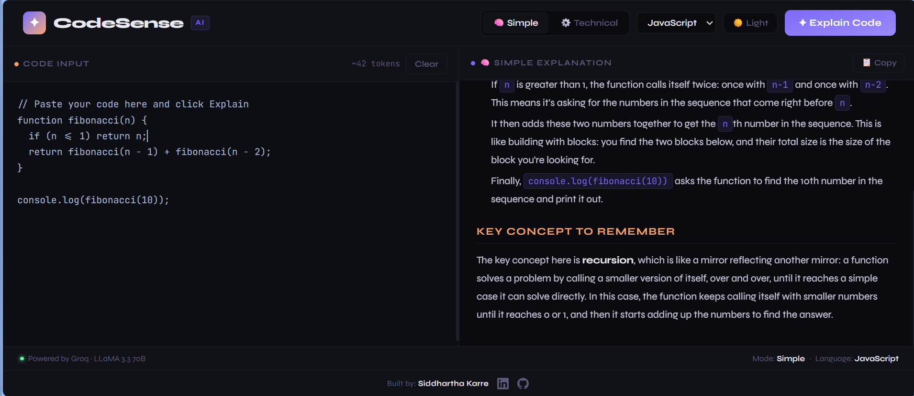

# ✦ CodeSense — AI Code Explainer

> Paste any code. Get a clear, instant explanation powered by LLaMA 3.3 70B via Groq.



## 🚀 Live Demo
👉 **[codesense.vercel.app](https://code-sense-seven-xi.vercel.app/)**

---

## ✨ Features

- **Two explanation modes** — Simple (beginner-friendly) and Technical (deep breakdown), each powered by a distinct system prompt
- **Real-time streaming** — explanations appear word by word as the AI generates them
- **10 languages supported** — JavaScript, Python, Java, C, C++, TypeScript, Go, Rust, PHP, Ruby
- **Markdown rendering** — structured output with headers, code blocks, and bullet points
- **Token counter** — live estimate of input size as you type
- **Copy explanation** — one-click copy of the full generated explanation
- **Tab key support** — press Tab inside the editor to indent code naturally
- **Error handling** — clear messages for API errors, missing keys, and invalid input

---

## 🛠 Tech Stack

| Layer | Technology |
|---|---|
| Frontend | React, Tailwind CSS |
| AI Model | LLaMA 3.3 70B Versatile |
| AI API | Groq API |
| Markdown | react-markdown |
| Deployment | Vercel |

---

## 📂 Project Structure

```
CodeSense/
├── src/
│   ├── App.jsx
│   ├── components/
│   ├── hooks/
│   └── assets/
│       └── preview.png      # Screenshot for README
├── .env.local           # VITE_GROQ_API_KEY (not committed)
├── .gitignore
└── package.json
```

---

## ⚙️ Getting Started

### 1. Clone the repository
```bash
git clone https://github.com/Siddhartha-karre/CodeSense.git
cd CodeSense
```

### 2. Install dependencies
```bash
npm install
```

### 3. Get your Groq API key
Sign up at [console.groq.com](https://console.groq.com) → API Keys → Create Key. It's free.

### 4. Add your API key
Create a `.env.local` file in the project root:
```
VITE_GROQ_API_KEY=gsk_your_key_here
```

### 5. Start the dev server
```bash
npm run dev
```

Open [http://localhost:5173](http://localhost:5173) and paste any code to get started.

---

## 🔐 API Key Security

- Your `.env.local` file is listed in `.gitignore` and will **never** be committed
- For production, add `VITE_GROQ_API_KEY` as an environment variable in your Vercel project settings under **Settings → Environment Variables**
- Set a monthly usage limit on [console.groq.com](https://console.groq.com) to avoid unexpected charges

---

## 📸 Screenshots

Add screenshots here if you want (optional).

---

## 🗺 Roadmap

- [ ] Syntax-highlighted code editor
- [ ] Save and share explanations via URL
- [ ] Support file upload (.js, .py, .java)
- [ ] Explanation history

---

## 👤 Author

**Siddhartha Karre**
- GitHub: [@Siddhartha-karre](https://github.com/Siddhartha-karre)
- LinkedIn: [linkedin.com/in/siddhartha-karre](https://linkedin.com/in/siddhartha-karre)

---

## 📄 License

MIT License — feel free to use this project for learning or building upon it.